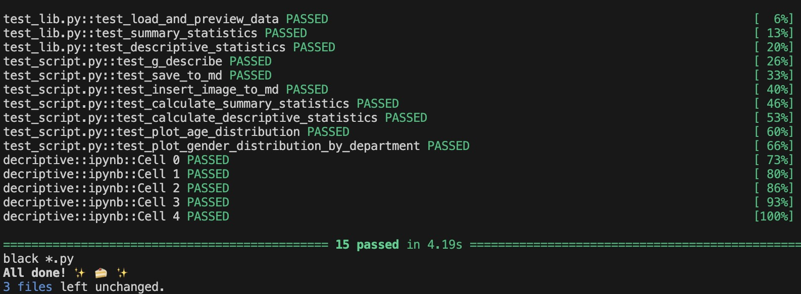

[](https://github.com/nogibjj/jingxuan_li_mini_project_1/actions/workflows/format.yml)
[](https://github.com/nogibjj/jingxuan_li_mini_project_1/actions/workflows/install.yml)
[](https://github.com/nogibjj/jingxuan_li_mini_project_1/actions/workflows/lint.yml)
[](https://github.com/nogibjj/jingxuan_li_mini_project_1/actions/workflows/test.yml)

[](https://github.com/nogibjj/ids-706-miniproject-2-jingxuan-li/actions/workflows/CICD.yml)

## Setup with VS Code and .devcontainer

Follow these steps to prepare and use your development environment:

### Prerequisites

- **Docker**: Ensure Docker is installed and running on your machine. [Download Docker](https://docs.docker.com/get-docker/).
- **Visual Studio Code**: Install VS Code if you haven't already. [Download VS Code](https://code.visualstudio.com/Download).
- **Remote - Containers Extension**: Install the **Remote - Containers** extension in VS Code by searching for it in the Extensions view (`Ctrl+Shift+X`).

### Getting Started

1. **Clone the Repository**:
   ```bash
   git clone git@github.com:Jourdan0803/ids-706-miniproject-2-jingxuan-li.git
   ```

2. **Open in VS Code**:
   Open the cloned repository folder in Visual Studio Code.

3. **Reopen in Container**:
   When prompted in VS Code, click on "Reopen in Container" to start working inside a Docker container. Alternatively, use the Command Palette (`Cmd+Shift+P` on macOS or `Ctrl+Shift+P` on Windows/Linux) and select **Remote-Containers: Reopen Folder in Container**.

4. **Build Docker Image**:
   On the first launch in a container, Docker will build the development environment as specified in the `.devcontainer/Dockerfile`. This process may take a few minutes depending on your internet connection and computer speed.

5. **Development Environment Ready**:
   Once the container setup is complete, you will have a fully configured Python development environment ready for use.


### Running Tests

To ensure your code modifications function correctly:

1. **Open Terminal in VS Code**:
   Use the integrated terminal in VS Code (`Ctrl+``), ensuring you are at the project root directory.

2. **Execute Tests**:
   Run the tests using the Makefile command:
   ```bash
   make test
   ```

3. **Review Test Results**:
   Examine the output in the terminal to verify that all tests pass without errors.



### Project Structure

Here is an overview of important files and directories in the repository:

- `.devcontainer/`: Contains Docker configuration files for setting up the development environment.
- `.github/workflows/`: Includes CI/CD pipeline configurations using GitHub Actions.
- `Makefile`: Defines scripts for common project tasks such as testing.
- `README.md`: Provides project documentation.
- `descriptive.md`: generate md file for the result of analysis
- `mylib/lib.py`: library script.
- `main.py`: Main Python script.
- `test_script.py`: test Main Python script.
- `test_lib.py`: test lib Python script.
- `requirements.txt`: Lists all Python dependencies.
- `decriptive.ipynb`: Jupiter Notebook script.

---
