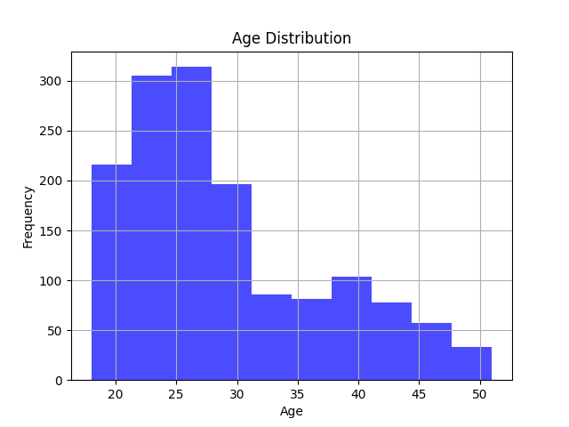

# Employee Data Overview
## Data Head
|    | EmployeeID   | FirstName   | LastName   | Gender     |   Age | BusinessTravel   | Department      |   DistanceFromHome (KM) | State   | Ethnicity               |   Education | EducationField   | JobRole             | MaritalStatus   |   Salary |   StockOptionLevel | OverTime   | HireDate   | Attrition   |   YearsAtCompany |   YearsInMostRecentRole |   YearsSinceLastPromotion |   YearsWithCurrManager |
|---:|:-------------|:------------|:-----------|:-----------|------:|:-----------------|:----------------|------------------------:|:--------|:------------------------|------------:|:-----------------|:--------------------|:----------------|---------:|-------------------:|:-----------|:-----------|:------------|-----------------:|------------------------:|--------------------------:|-----------------------:|
|  0 | 3012-1A41    | Leonelle    | Simco      | Female     |    30 | Some Travel      | Sales           |                      27 | IL      | White                   |           5 | Marketing        | Sales Executive     | Divorced        |   102059 |                  1 | No         | 2012-01-03 | No          |               10 |                       4 |                         9 |                      7 |
|  1 | CBCB-9C9D    | Leonerd     | Aland      | Male       |    38 | Some Travel      | Sales           |                      23 | CA      | White                   |           4 | Marketing        | Sales Executive     | Single          |   157718 |                  0 | Yes        | 2012-01-04 | No          |               10 |                       6 |                        10 |                      0 |
|  2 | 95D7-1CE9    | Ahmed       | Sykes      | Male       |    43 | Some Travel      | Human Resources |                      29 | CA      | Asian or Asian American |           4 | Marketing        | HR Business Partner | Married         |   309964 |                  1 | No         | 2012-01-04 | No          |               10 |                       6 |                        10 |                      8 |
|  3 | 47A0-559B    | Ermentrude  | Berrie     | Non-Binary |    39 | Some Travel      | Technology      |                      12 | IL      | White                   |           3 | Computer Science | Engineering Manager | Married         |   293132 |                  0 | No         | 2012-01-05 | No          |               10 |                      10 |                        10 |                      0 |
|  4 | 42CC-040A    | Stace       | Savege     | Female     |    29 | Some Travel      | Human Resources |                      29 | CA      | White                   |           2 | Technical Degree | Recruiter           | Single          |    49606 |                  0 | No         | 2012-01-05 | Yes         |                6 |                       1 |                         1 |                      6 |
## Summary Statistics
|       |        Age |   DistanceFromHome (KM) |   Education |   Salary |   StockOptionLevel |   YearsAtCompany |   YearsInMostRecentRole |   YearsSinceLastPromotion |   YearsWithCurrManager |
|:------|-----------:|------------------------:|------------:|---------:|-------------------:|-----------------:|------------------------:|--------------------------:|-----------------------:|
| count | 1470       |               1470      |  1470       |   1470   |        1470        |       1470       |              1470       |                1470       |             1470       |
| mean  |   28.9898  |                 22.5027 |     2.91293 | 112956   |           0.793878 |          4.56259 |                 2.2932  |                   3.44082 |                2.23946 |
| std   |    7.99306 |                 12.8111 |     1.02416 | 103343   |           0.852077 |          3.28805 |                 2.53909 |                   2.94519 |                2.50577 |
| min   |   18       |                  1      |     1       |  20387   |           0        |          0       |                 0       |                   0       |                0       |
| 25%   |   23       |                 12      |     2       |  43580.5 |           0        |          2       |                 0       |                   1       |                0       |
| 50%   |   26       |                 22      |     3       |  71199.5 |           1        |          4       |                 1       |                   3       |                1       |
| 75%   |   34       |                 33      |     4       | 142056   |           1        |          7       |                 4       |                   6       |                4       |
| max   |   51       |                 45      |     5       | 547204   |           3        |         10       |                10       |                  10       |               10       |
## Descriptive Statistics for Age and Salary
## Age Distribution Plot

## Gender Distribution by Department Plot

# Employee Data Overview
## Data Head
|    | EmployeeID   | FirstName   | LastName   | Gender     |   Age | BusinessTravel   | Department      |   DistanceFromHome (KM) | State   | Ethnicity               |   Education | EducationField   | JobRole             | MaritalStatus   |   Salary |   StockOptionLevel | OverTime   | HireDate   | Attrition   |   YearsAtCompany |   YearsInMostRecentRole |   YearsSinceLastPromotion |   YearsWithCurrManager |
|---:|:-------------|:------------|:-----------|:-----------|------:|:-----------------|:----------------|------------------------:|:--------|:------------------------|------------:|:-----------------|:--------------------|:----------------|---------:|-------------------:|:-----------|:-----------|:------------|-----------------:|------------------------:|--------------------------:|-----------------------:|
|  0 | 3012-1A41    | Leonelle    | Simco      | Female     |    30 | Some Travel      | Sales           |                      27 | IL      | White                   |           5 | Marketing        | Sales Executive     | Divorced        |   102059 |                  1 | No         | 2012-01-03 | No          |               10 |                       4 |                         9 |                      7 |
|  1 | CBCB-9C9D    | Leonerd     | Aland      | Male       |    38 | Some Travel      | Sales           |                      23 | CA      | White                   |           4 | Marketing        | Sales Executive     | Single          |   157718 |                  0 | Yes        | 2012-01-04 | No          |               10 |                       6 |                        10 |                      0 |
|  2 | 95D7-1CE9    | Ahmed       | Sykes      | Male       |    43 | Some Travel      | Human Resources |                      29 | CA      | Asian or Asian American |           4 | Marketing        | HR Business Partner | Married         |   309964 |                  1 | No         | 2012-01-04 | No          |               10 |                       6 |                        10 |                      8 |
|  3 | 47A0-559B    | Ermentrude  | Berrie     | Non-Binary |    39 | Some Travel      | Technology      |                      12 | IL      | White                   |           3 | Computer Science | Engineering Manager | Married         |   293132 |                  0 | No         | 2012-01-05 | No          |               10 |                      10 |                        10 |                      0 |
|  4 | 42CC-040A    | Stace       | Savege     | Female     |    29 | Some Travel      | Human Resources |                      29 | CA      | White                   |           2 | Technical Degree | Recruiter           | Single          |    49606 |                  0 | No         | 2012-01-05 | Yes         |                6 |                       1 |                         1 |                      6 |
## Summary Statistics
|       |        Age |   DistanceFromHome (KM) |   Education |   Salary |   StockOptionLevel |   YearsAtCompany |   YearsInMostRecentRole |   YearsSinceLastPromotion |   YearsWithCurrManager |
|:------|-----------:|------------------------:|------------:|---------:|-------------------:|-----------------:|------------------------:|--------------------------:|-----------------------:|
| count | 1470       |               1470      |  1470       |   1470   |        1470        |       1470       |              1470       |                1470       |             1470       |
| mean  |   28.9898  |                 22.5027 |     2.91293 | 112956   |           0.793878 |          4.56259 |                 2.2932  |                   3.44082 |                2.23946 |
| std   |    7.99306 |                 12.8111 |     1.02416 | 103343   |           0.852077 |          3.28805 |                 2.53909 |                   2.94519 |                2.50577 |
| min   |   18       |                  1      |     1       |  20387   |           0        |          0       |                 0       |                   0       |                0       |
| 25%   |   23       |                 12      |     2       |  43580.5 |           0        |          2       |                 0       |                   1       |                0       |
| 50%   |   26       |                 22      |     3       |  71199.5 |           1        |          4       |                 1       |                   3       |                1       |
| 75%   |   34       |                 33      |     4       | 142056   |           1        |          7       |                 4       |                   6       |                4       |
| max   |   51       |                 45      |     5       | 547204   |           3        |         10       |                10       |                  10       |               10       |
## Descriptive Statistics for Age and Salary
## Age Distribution Plot

## Gender Distribution by Department Plot

# Employee Data Overview
## Data Head
|    | EmployeeID   | FirstName   | LastName   | Gender     |   Age | BusinessTravel   | Department      |   DistanceFromHome (KM) | State   | Ethnicity               |   Education | EducationField   | JobRole             | MaritalStatus   |   Salary |   StockOptionLevel | OverTime   | HireDate   | Attrition   |   YearsAtCompany |   YearsInMostRecentRole |   YearsSinceLastPromotion |   YearsWithCurrManager |
|---:|:-------------|:------------|:-----------|:-----------|------:|:-----------------|:----------------|------------------------:|:--------|:------------------------|------------:|:-----------------|:--------------------|:----------------|---------:|-------------------:|:-----------|:-----------|:------------|-----------------:|------------------------:|--------------------------:|-----------------------:|
|  0 | 3012-1A41    | Leonelle    | Simco      | Female     |    30 | Some Travel      | Sales           |                      27 | IL      | White                   |           5 | Marketing        | Sales Executive     | Divorced        |   102059 |                  1 | No         | 2012-01-03 | No          |               10 |                       4 |                         9 |                      7 |
|  1 | CBCB-9C9D    | Leonerd     | Aland      | Male       |    38 | Some Travel      | Sales           |                      23 | CA      | White                   |           4 | Marketing        | Sales Executive     | Single          |   157718 |                  0 | Yes        | 2012-01-04 | No          |               10 |                       6 |                        10 |                      0 |
|  2 | 95D7-1CE9    | Ahmed       | Sykes      | Male       |    43 | Some Travel      | Human Resources |                      29 | CA      | Asian or Asian American |           4 | Marketing        | HR Business Partner | Married         |   309964 |                  1 | No         | 2012-01-04 | No          |               10 |                       6 |                        10 |                      8 |
|  3 | 47A0-559B    | Ermentrude  | Berrie     | Non-Binary |    39 | Some Travel      | Technology      |                      12 | IL      | White                   |           3 | Computer Science | Engineering Manager | Married         |   293132 |                  0 | No         | 2012-01-05 | No          |               10 |                      10 |                        10 |                      0 |
|  4 | 42CC-040A    | Stace       | Savege     | Female     |    29 | Some Travel      | Human Resources |                      29 | CA      | White                   |           2 | Technical Degree | Recruiter           | Single          |    49606 |                  0 | No         | 2012-01-05 | Yes         |                6 |                       1 |                         1 |                      6 |
## Summary Statistics
|       |        Age |   DistanceFromHome (KM) |   Education |   Salary |   StockOptionLevel |   YearsAtCompany |   YearsInMostRecentRole |   YearsSinceLastPromotion |   YearsWithCurrManager |
|:------|-----------:|------------------------:|------------:|---------:|-------------------:|-----------------:|------------------------:|--------------------------:|-----------------------:|
| count | 1470       |               1470      |  1470       |   1470   |        1470        |       1470       |              1470       |                1470       |             1470       |
| mean  |   28.9898  |                 22.5027 |     2.91293 | 112956   |           0.793878 |          4.56259 |                 2.2932  |                   3.44082 |                2.23946 |
| std   |    7.99306 |                 12.8111 |     1.02416 | 103343   |           0.852077 |          3.28805 |                 2.53909 |                   2.94519 |                2.50577 |
| min   |   18       |                  1      |     1       |  20387   |           0        |          0       |                 0       |                   0       |                0       |
| 25%   |   23       |                 12      |     2       |  43580.5 |           0        |          2       |                 0       |                   1       |                0       |
| 50%   |   26       |                 22      |     3       |  71199.5 |           1        |          4       |                 1       |                   3       |                1       |
| 75%   |   34       |                 33      |     4       | 142056   |           1        |          7       |                 4       |                   6       |                4       |
| max   |   51       |                 45      |     5       | 547204   |           3        |         10       |                10       |                  10       |               10       |
## Descriptive Statistics for Age and Salary
## Age Distribution Plot

## Gender Distribution by Department Plot

# Employee Data Overview
## Data Head
|    | EmployeeID   | FirstName   | LastName   | Gender     |   Age | BusinessTravel   | Department      |   DistanceFromHome (KM) | State   | Ethnicity               |   Education | EducationField   | JobRole             | MaritalStatus   |   Salary |   StockOptionLevel | OverTime   | HireDate   | Attrition   |   YearsAtCompany |   YearsInMostRecentRole |   YearsSinceLastPromotion |   YearsWithCurrManager |
|---:|:-------------|:------------|:-----------|:-----------|------:|:-----------------|:----------------|------------------------:|:--------|:------------------------|------------:|:-----------------|:--------------------|:----------------|---------:|-------------------:|:-----------|:-----------|:------------|-----------------:|------------------------:|--------------------------:|-----------------------:|
|  0 | 3012-1A41    | Leonelle    | Simco      | Female     |    30 | Some Travel      | Sales           |                      27 | IL      | White                   |           5 | Marketing        | Sales Executive     | Divorced        |   102059 |                  1 | No         | 2012-01-03 | No          |               10 |                       4 |                         9 |                      7 |
|  1 | CBCB-9C9D    | Leonerd     | Aland      | Male       |    38 | Some Travel      | Sales           |                      23 | CA      | White                   |           4 | Marketing        | Sales Executive     | Single          |   157718 |                  0 | Yes        | 2012-01-04 | No          |               10 |                       6 |                        10 |                      0 |
|  2 | 95D7-1CE9    | Ahmed       | Sykes      | Male       |    43 | Some Travel      | Human Resources |                      29 | CA      | Asian or Asian American |           4 | Marketing        | HR Business Partner | Married         |   309964 |                  1 | No         | 2012-01-04 | No          |               10 |                       6 |                        10 |                      8 |
|  3 | 47A0-559B    | Ermentrude  | Berrie     | Non-Binary |    39 | Some Travel      | Technology      |                      12 | IL      | White                   |           3 | Computer Science | Engineering Manager | Married         |   293132 |                  0 | No         | 2012-01-05 | No          |               10 |                      10 |                        10 |                      0 |
|  4 | 42CC-040A    | Stace       | Savege     | Female     |    29 | Some Travel      | Human Resources |                      29 | CA      | White                   |           2 | Technical Degree | Recruiter           | Single          |    49606 |                  0 | No         | 2012-01-05 | Yes         |                6 |                       1 |                         1 |                      6 |
## Summary Statistics
|       |        Age |   DistanceFromHome (KM) |   Education |   Salary |   StockOptionLevel |   YearsAtCompany |   YearsInMostRecentRole |   YearsSinceLastPromotion |   YearsWithCurrManager |
|:------|-----------:|------------------------:|------------:|---------:|-------------------:|-----------------:|------------------------:|--------------------------:|-----------------------:|
| count | 1470       |               1470      |  1470       |   1470   |        1470        |       1470       |              1470       |                1470       |             1470       |
| mean  |   28.9898  |                 22.5027 |     2.91293 | 112956   |           0.793878 |          4.56259 |                 2.2932  |                   3.44082 |                2.23946 |
| std   |    7.99306 |                 12.8111 |     1.02416 | 103343   |           0.852077 |          3.28805 |                 2.53909 |                   2.94519 |                2.50577 |
| min   |   18       |                  1      |     1       |  20387   |           0        |          0       |                 0       |                   0       |                0       |
| 25%   |   23       |                 12      |     2       |  43580.5 |           0        |          2       |                 0       |                   1       |                0       |
| 50%   |   26       |                 22      |     3       |  71199.5 |           1        |          4       |                 1       |                   3       |                1       |
| 75%   |   34       |                 33      |     4       | 142056   |           1        |          7       |                 4       |                   6       |                4       |
| max   |   51       |                 45      |     5       | 547204   |           3        |         10       |                10       |                  10       |               10       |
## Descriptive Statistics for Age and Salary
## Age Distribution Plot

## Gender Distribution by Department Plot

# Employee Data Overview
## Data Head
|    | EmployeeID   | FirstName   | LastName   | Gender     |   Age | BusinessTravel   | Department      |   DistanceFromHome (KM) | State   | Ethnicity               |   Education | EducationField   | JobRole             | MaritalStatus   |   Salary |   StockOptionLevel | OverTime   | HireDate   | Attrition   |   YearsAtCompany |   YearsInMostRecentRole |   YearsSinceLastPromotion |   YearsWithCurrManager |
|---:|:-------------|:------------|:-----------|:-----------|------:|:-----------------|:----------------|------------------------:|:--------|:------------------------|------------:|:-----------------|:--------------------|:----------------|---------:|-------------------:|:-----------|:-----------|:------------|-----------------:|------------------------:|--------------------------:|-----------------------:|
|  0 | 3012-1A41    | Leonelle    | Simco      | Female     |    30 | Some Travel      | Sales           |                      27 | IL      | White                   |           5 | Marketing        | Sales Executive     | Divorced        |   102059 |                  1 | No         | 2012-01-03 | No          |               10 |                       4 |                         9 |                      7 |
|  1 | CBCB-9C9D    | Leonerd     | Aland      | Male       |    38 | Some Travel      | Sales           |                      23 | CA      | White                   |           4 | Marketing        | Sales Executive     | Single          |   157718 |                  0 | Yes        | 2012-01-04 | No          |               10 |                       6 |                        10 |                      0 |
|  2 | 95D7-1CE9    | Ahmed       | Sykes      | Male       |    43 | Some Travel      | Human Resources |                      29 | CA      | Asian or Asian American |           4 | Marketing        | HR Business Partner | Married         |   309964 |                  1 | No         | 2012-01-04 | No          |               10 |                       6 |                        10 |                      8 |
|  3 | 47A0-559B    | Ermentrude  | Berrie     | Non-Binary |    39 | Some Travel      | Technology      |                      12 | IL      | White                   |           3 | Computer Science | Engineering Manager | Married         |   293132 |                  0 | No         | 2012-01-05 | No          |               10 |                      10 |                        10 |                      0 |
|  4 | 42CC-040A    | Stace       | Savege     | Female     |    29 | Some Travel      | Human Resources |                      29 | CA      | White                   |           2 | Technical Degree | Recruiter           | Single          |    49606 |                  0 | No         | 2012-01-05 | Yes         |                6 |                       1 |                         1 |                      6 |
## Summary Statistics
|       |        Age |   DistanceFromHome (KM) |   Education |   Salary |   StockOptionLevel |   YearsAtCompany |   YearsInMostRecentRole |   YearsSinceLastPromotion |   YearsWithCurrManager |
|:------|-----------:|------------------------:|------------:|---------:|-------------------:|-----------------:|------------------------:|--------------------------:|-----------------------:|
| count | 1470       |               1470      |  1470       |   1470   |        1470        |       1470       |              1470       |                1470       |             1470       |
| mean  |   28.9898  |                 22.5027 |     2.91293 | 112956   |           0.793878 |          4.56259 |                 2.2932  |                   3.44082 |                2.23946 |
| std   |    7.99306 |                 12.8111 |     1.02416 | 103343   |           0.852077 |          3.28805 |                 2.53909 |                   2.94519 |                2.50577 |
| min   |   18       |                  1      |     1       |  20387   |           0        |          0       |                 0       |                   0       |                0       |
| 25%   |   23       |                 12      |     2       |  43580.5 |           0        |          2       |                 0       |                   1       |                0       |
| 50%   |   26       |                 22      |     3       |  71199.5 |           1        |          4       |                 1       |                   3       |                1       |
| 75%   |   34       |                 33      |     4       | 142056   |           1        |          7       |                 4       |                   6       |                4       |
| max   |   51       |                 45      |     5       | 547204   |           3        |         10       |                10       |                  10       |               10       |
## Descriptive Statistics for Age and Salary
## Age Distribution Plot

## Gender Distribution by Department Plot

# Employee Data Overview
## Data Head
|    | EmployeeID   | FirstName   | LastName   | Gender     |   Age | BusinessTravel   | Department      |   DistanceFromHome (KM) | State   | Ethnicity               |   Education | EducationField   | JobRole             | MaritalStatus   |   Salary |   StockOptionLevel | OverTime   | HireDate   | Attrition   |   YearsAtCompany |   YearsInMostRecentRole |   YearsSinceLastPromotion |   YearsWithCurrManager |
|---:|:-------------|:------------|:-----------|:-----------|------:|:-----------------|:----------------|------------------------:|:--------|:------------------------|------------:|:-----------------|:--------------------|:----------------|---------:|-------------------:|:-----------|:-----------|:------------|-----------------:|------------------------:|--------------------------:|-----------------------:|
|  0 | 3012-1A41    | Leonelle    | Simco      | Female     |    30 | Some Travel      | Sales           |                      27 | IL      | White                   |           5 | Marketing        | Sales Executive     | Divorced        |   102059 |                  1 | No         | 2012-01-03 | No          |               10 |                       4 |                         9 |                      7 |
|  1 | CBCB-9C9D    | Leonerd     | Aland      | Male       |    38 | Some Travel      | Sales           |                      23 | CA      | White                   |           4 | Marketing        | Sales Executive     | Single          |   157718 |                  0 | Yes        | 2012-01-04 | No          |               10 |                       6 |                        10 |                      0 |
|  2 | 95D7-1CE9    | Ahmed       | Sykes      | Male       |    43 | Some Travel      | Human Resources |                      29 | CA      | Asian or Asian American |           4 | Marketing        | HR Business Partner | Married         |   309964 |                  1 | No         | 2012-01-04 | No          |               10 |                       6 |                        10 |                      8 |
|  3 | 47A0-559B    | Ermentrude  | Berrie     | Non-Binary |    39 | Some Travel      | Technology      |                      12 | IL      | White                   |           3 | Computer Science | Engineering Manager | Married         |   293132 |                  0 | No         | 2012-01-05 | No          |               10 |                      10 |                        10 |                      0 |
|  4 | 42CC-040A    | Stace       | Savege     | Female     |    29 | Some Travel      | Human Resources |                      29 | CA      | White                   |           2 | Technical Degree | Recruiter           | Single          |    49606 |                  0 | No         | 2012-01-05 | Yes         |                6 |                       1 |                         1 |                      6 |
## Summary Statistics
|       |        Age |   DistanceFromHome (KM) |   Education |   Salary |   StockOptionLevel |   YearsAtCompany |   YearsInMostRecentRole |   YearsSinceLastPromotion |   YearsWithCurrManager |
|:------|-----------:|------------------------:|------------:|---------:|-------------------:|-----------------:|------------------------:|--------------------------:|-----------------------:|
| count | 1470       |               1470      |  1470       |   1470   |        1470        |       1470       |              1470       |                1470       |             1470       |
| mean  |   28.9898  |                 22.5027 |     2.91293 | 112956   |           0.793878 |          4.56259 |                 2.2932  |                   3.44082 |                2.23946 |
| std   |    7.99306 |                 12.8111 |     1.02416 | 103343   |           0.852077 |          3.28805 |                 2.53909 |                   2.94519 |                2.50577 |
| min   |   18       |                  1      |     1       |  20387   |           0        |          0       |                 0       |                   0       |                0       |
| 25%   |   23       |                 12      |     2       |  43580.5 |           0        |          2       |                 0       |                   1       |                0       |
| 50%   |   26       |                 22      |     3       |  71199.5 |           1        |          4       |                 1       |                   3       |                1       |
| 75%   |   34       |                 33      |     4       | 142056   |           1        |          7       |                 4       |                   6       |                4       |
| max   |   51       |                 45      |     5       | 547204   |           3        |         10       |                10       |                  10       |               10       |
## Descriptive Statistics for Age and Salary
## Age Distribution Plot

## Gender Distribution by Department Plot

